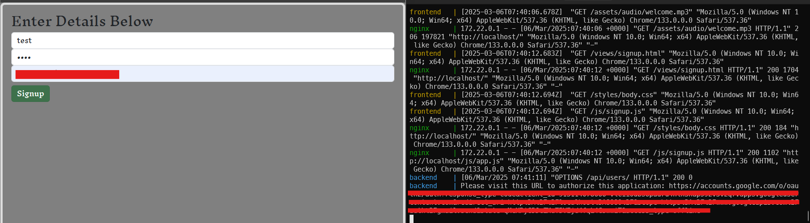

# ft_transcendence

This project is a multiplayer Pong game featuring real-time gameplay, AI opponents, 3D rendering using Three.js, live chat, and more. It is being developed using Django for the backend and Bootstrap for the frontend.

## Project Structure

```bash
project/
│
├── backend/                            # Django Backend
│   ├── pong/                           # Main Django app (handles game logic, user management, etc.)
│   ├── users/                          # Django app for user management (registration, authentication, etc.)
│   ├── game/                           # Game logic (API for frontend, game matchmaking)
│   ├── chat/                           # Live chat application
│   ├── api/                            # API app for external/CLI communication
│   ├── Dockerfile                      # Dockerfile for Django backend
│   ├── requirements.txt                # Python dependencies (Django, Redis, Celery, etc.)
│   ├── settings.py                     # Django settings (integrates Redis, PostgreSQL, etc.)
│   ├── celery.py                       # Celery configuration for task handling
│   └── manage.py                       # Django management commands
│
├── frontend/                           # Frontend (JavaScript/Bootstrap/Three.js)
│   ├── src/                            # Source files for the frontend
│   │   ├── assets/                     # Static files (CSS, images, etc.)
│   │   ├── js/                         # JavaScript files (Three.js for 3D rendering, WebSocket logic)
│   │   │   └── game3D.js               # Three.js logic for 3D Pong game
│   │   └── index.html                  # Main HTML file for the UI
│   ├── Dockerfile                      # Dockerfile for the frontend
│   └── package.json                    # Frontend dependencies (Bootstrap, WebSocket libraries, Three.js)
│
├── redis/                              # Redis container setup
│   └── redis.conf                      # Redis configuration file (optional customization)
│   └── Dockerfile                      # Redis container (prebuilt Redis image)
│
├── postgres/                           # PostgreSQL container setup
│   └── init.sql                        # SQL initialization script (for database structure, users, game history)
│   └── Dockerfile                      # PostgreSQL container (prebuilt Postgres image)
│
├── ai/                                 # AI Logic
│   └── ai_worker.py                    # AI logic processing file (Celery task for asynchronous AI processing)
│   └── Dockerfile                      # Dockerfile for AI processing
│
├── websocket/                          # WebSocket server for real-time game and chat
│   └── ws_server.py                    # WebSocket server logic for real-time game updates and chat
│   └── Dockerfile                      # Dockerfile for WebSocket service
│
├── cli_game/                           # CLI Pong Game setup
│   └── cli_pong.py                     # Main Python file for CLI Pong game logic
│   └── Dockerfile                      # Dockerfile for CLI Pong
│
├── nginx/                              # Nginx reverse proxy (optional)
│   └── nginx.conf                      # Nginx configuration for routing requests to different services
│   └── Dockerfile                      # Dockerfile for Nginx
│
├── docker-compose.yml                  # Docker Compose file to orchestrate all containers
├── .env                                # Environment variables for sensitive data (PostgreSQL, Redis settings)

```

## Technologies Used

- **Django** for the backend
- **PostgreSQL** for the database
- **Redis** for caching and task queue management
- **Three.js** for 3D rendering of the Pong game
- **WebSocket** for real-time game updates and live chat
- **Celery** for handling AI logic in the background
- **Docker** for containerization

## API endpoint
### Application Service
| Method | Path | Usage | 
| ---- | ---- | --- |
| POST | /api/codeverify | verify code in MFA |
| POST | /api/login | login by email and password |
| POST | /api/signup | signup a user and send verification mail |
| POST | /api/oauth| get jwt using authentication code in Oauth |
| POST | /api/token/refresh | refresh jwt usign refresh token |
| POST | /api/token/verify | verify acccess token or refresh token |

### User Model
| Method | Path | Loigin required | Usage | 
| ----  | ---- | ---- | --- |
| GET   | /api/users/ | Y | list all users' data |
| POST  | /api/users/ | N | registrate a user |
| PATCH | /api/users/ | Y | update current user's data |
| GET   | /api/users/me | Y | get current user's data |
| GET   | /api/users/\<username> | Y | retrieve specific user data |

## Project Setup

1. Clone the repository:

   ```bash
   git clone https://github.com/your-repo/ft_transcendence.git
   cd ft_transcendence/project
   ```

2. Build the Docker containers:
   docker-compose up --build

3. Add environment variables to the .env file
   ```
   POSTGRES_HOST=<hostname>
   POSTGRES_DB=<database_name>
   POSTGRES_USER=<admin_name>
   POSTGRES_PASSWORD=<admin_password>
   
   DJANGO_SUPERUSER_USERNAME=<user_name>
   DJANGO_SUPERUSER_EMAIL=<user_mail>
   DJANGO_SUPERUSER_PASSWORD=<user_password>
   
   # Django secret key
   DJANGO_SECRET_KEY=<secret_key>
   DJANGO_DEBUG=1

   # 42 Oauth Authorization App
   # NOTE: secret is updated every 4 weeks
   CLIENT_ID=u-s4t2ud-7eb0d578913ab9934c2b116843901211c2e920a996f3a96f058464f1d33e1f38
   CLIENT_SECRET=< client secret (*contact developers to get value) >

   # Websocket/frontend shared volume path
   CONFIG_PATH=/config/settings.json

   # Google Oauth Authorization App for sending email
   EMAIL_HOST_USER=< email address >
   EMAIL_HOST_PASSWORD=< password >
   GOOGLE_CLIENT_ID="915114078666-vlcii0ubsopadru4nln3hap592v3v2q7.apps.googleusercontent.com"
   GOOGLE_PROJECT_ID="my-project-1511163788942"
   GOOGLE_CLIENT_SECRET=< client secret (*contact developers to get value) >

   # Test User (optional)
   DJANGO_TEST_NAME_1=test1
   DJANGO_TEST_EMAIL_1=test1@example.com
   DJANGO_TEST_PASSWORD_1=test1

   DJANGO_TEST_NAME_2=test2
   DJANGO_TEST_EMAIL_2=test2@example.com
   DJANGO_TEST_PASSWORD_2=test2

   DJANGO_TEST_NAME_3=test3
   DJANGO_TEST_EMAIL_3=test3@example.com
   DJANGO_TEST_PASSWORD_3=test3
   ```

# Email Setup
1. Make sure to add environment variables in `.env` for Google Oauth.

2. Get credential token by accessing the url displayed in console and login with `EMAIL_HOST_USER` user.
   
   *url is displayed when app makes an attempts to send an email
   <br>
   *token expires a week after creation
